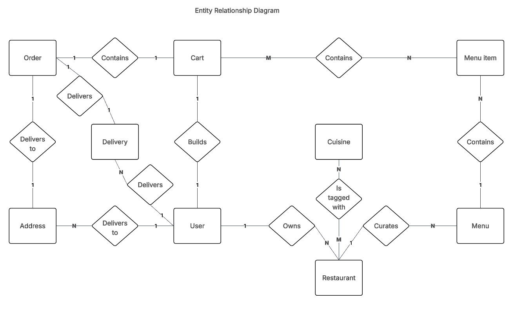

# Design Document

## Data Flow Diagrams

These diagrams are not exhaustive and 100% correct. They should be used to help us during implementation.

## Data Flow Diagrams

These diagrams are not exhaustive and 100% correct. They should be used to help us during implementation.

## URL Design

- api/                  Return a health status.  
    - restaurants/      Return all restaurants.  
    - restaurant/       INACCESSIBLE.  
        - create/  
        - ID/           Return a single restaurant.  
            - update/  
            - menus/    Return a list of restaurant menus.  
    - menu/             INACCESSIBLE.  
        - create/  
        - ID/           Return a single menu.  
            - update/  
    - dish/             INACCESSIBLE.
        - create/  
        - ID/           Return a single dish.
            - update/  

## Entity Relationship Diagram

## Documents

While attempting to design the data structure in a relational fashion, it became apparent that designing a bespoke RDBMS would be difficult for the project. Therefore, this design is document-based. Each document listed below will exist as a json file and each value in the file will have the listed keys.

### User
- email: user contact email address, also acts as login username
- password_hash: encrypted user password string
- is_admin: boolean flag indicating administrative rights
- is_active: boolean flag showing account activity status
- addresses: nested map of saved delivery locations containing recipient names and address lines
- cart: nested map of unsubmitted items currently stored in the user's shopping cart

### Restaurant
- owner_id: user ID reference indicating the restaurant's owner
- name: display name of the restaurant
- description: short overview text describing the establishment
- address: nested address object containing street, city, region, postcode and country
- phone_number: contact telephone number for the business
- is_active: boolean flag representing restaurant operational status
- cuisine_ids: array of linked cuisine tag IDs
- menus: nested map of menus containing active state and menu items

### Order

- orderer_id: user ID reference to the customer who submitted the order
- address: embedded delivery destination details, including recipient name
- placed_at: timestamp string recording when the order was submitted
- state: current lifecycle status of the order. States: (placed, preparing, waiting_for_driver, collected, delivered, cancelled)
- items: nested map of purchased items preserving historical name and price snapshots

Note that an order acts like a snapshot of an order when it was placed. Therefore, it may appear that there is some data redundency, but be assured that this is by design.  

For example, address is recorded again rather than relying on the orderer's address attribute. If the orderer later deleted their address or changed some of it, the record of the order will show erroneous data. It should represent the order at the time of ordering.

### Delivery
- order_id: order ID reference linking the delivery to a specific order
- deliverer_id: user ID of the assigned delivery driver
- state: current status tracking the delivery progress. States: (accepted, collected, delivered). Notice no cancelled state because the brief did not mention that deliveries could be cancelled once collected.
- delivered_at: timestamp string marking the completion time of delivery

### Cuisine
- name: text label of the cuisine category used for restaurant filtering
